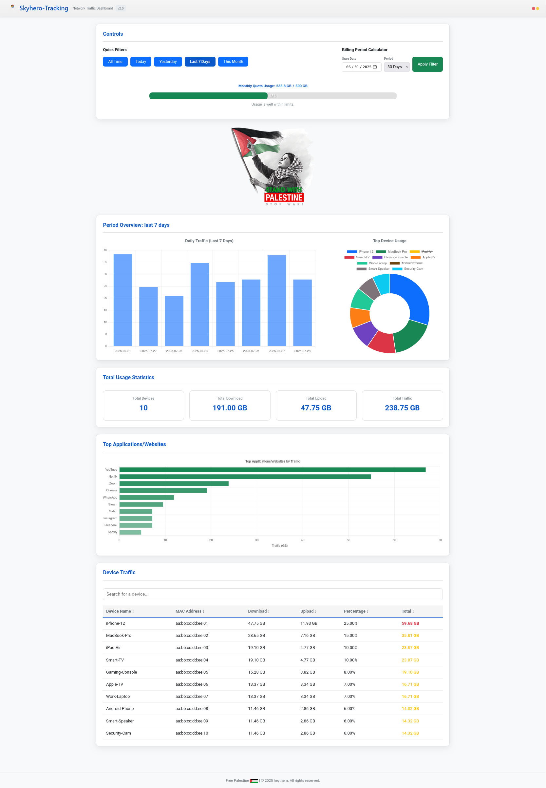
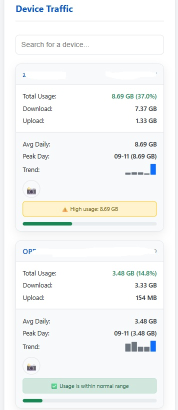

# skyhero-router-monitor
Shell-based v2.0 network-traffic &amp; device monitor for AsusWRT-Merlin firmware — runs as a separate web dashboard; archived for educational and research use, illustrating design patterns and scripting techniques.

### 📸skyhero main dashboard <br/>
<div align="center">
   <br/>
  <br/>
  
</div>

  
## 📋 Prerequisites

### ✅ Basic Requirements
- ASUS router (any model supporting Merlin) model that supports "Traffic Analyzer" but not sure if it's a must..
- ASUS Merlin firmware installed

### 🔧 Required Packages
Run these commands on your router before using the script:
<pre>
```bash
opkg update
opkg install jq
opkg install lighttpd 
opkg install lighttpd-mod-cgi
  ```
</pre>

# if any of these lines failed then first install :
🔴 <u>**Entware**</u>  <br/>
by running "amtm" on your sh and install is using the code "ep" it's merlin related script

# to Install the 2.0 script Run manually
# ym = usb name
<pre>
```bash
chmod +x /tmp/mnt/ym/skyhero-v2/install.sh
/tmp/mnt/ym/skyhero-v2/install.sh
  ```
</pre>

License
Distributed under the MIT License.

⚠️ if you want something reliable to run on your rotuer use version v2.1 , this one only for reseach


⭐ Show Your Support
Give a ⭐ if this project helped you!
